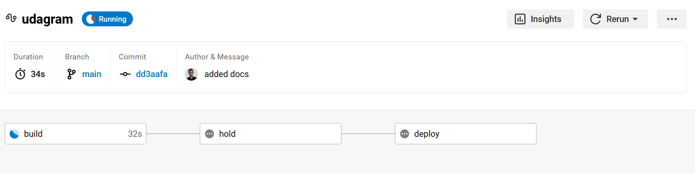

# CircleCi
CircleCi is a continuous integration service that can be used to build and test your project.

---

## Setup
### 1. Create a CircleCi account
Create a CircleCi account at https://circleci.com/signup/
### 2. Add your project
Add your project to CircleCi by following the instructions at https://circleci.com/docs/2.0/getting-started
### 3. Create .circleci/config.yml
Create a `.circleci/config.yml` file in your project's root directory.
### 4. Add the following to .circleci/config.yml
```yaml
version: 2.1
orbs:
  # orgs contain basc recipes and reproducible actions (install node, aws, etc.)
  node: circleci/node@5.0.2
  eb: circleci/aws-elastic-beanstalk@2.0.1
  aws-cli: circleci/aws-cli@3.1.1
  # different jobs are calles later in the workflows sections
jobs:
  build:
    docker:
      # the base image can run most needed actions with orbs
      - image: "cimg/node:14.15"
    steps:
      # install node and checkout code
      - node/install:
          node-version: '14.15'
      - checkout
      # Use root level package.json to install dependencies in the frontend app
      - run:
          name: Install Front-End Dependencies
          command: |
            echo "NODE --version" 
            echo $(node --version)
            echo "NPM --version" 
            echo $(npm --version)
            npm run frontend:install
      # TODO: Install dependencies in the the backend API          
      - run:
          name: Install API Dependencies
          command: |
           echo "TODO: Install dependencies in the the backend API  "
           npm run api:install
      # TODO: Lint the frontend
      - run:
          name: Front-End Lint
          command: |
            echo "TODO: Lint the frontend"
            npm run frontend:lint
      # TODO: Build the frontend app
      - run:
          name: Front-End Build
          command: |
            echo "TODO: Build the frontend app"
            npm run frontend:build
      # TODO: Build the backend API      
      - run:
          name: API Build
          command: |
            echo "TODO: Build the backend API"
            npm run api:build
  # deploy step will run only after manual approval
  deploy:
    docker:
      - image: "cimg/base:stable"
      # more setup needed for aws, node, elastic beanstalk
    steps:
      - node/install:
          node-version: '14.15' 
      - eb/setup
      - aws-cli/setup
      - checkout
      - run:
          name: Deploy App
          # TODO: Install, build, deploy in both apps
          command: |
            echo "Deploy both apps"
            npm run deploy
workflows:
  udagram:
    jobs:
      - build
      - hold:
          filters:
            branches:
              only:
                - main
          type: approval
          requires:
            - build
      - deploy:
          requires:
            - hold

```
### 5. Add environment variables to the CircleCi context
Add the following environment variables to the CircleCi context:
- AWS_ACCESS_KEY_ID
- AWS_SECRET_ACCESS_KEY
- AWS_Default_REGION
- AWS_PROFILE

---

>"Before every success, there are failures"


---

## last build screenshots

### building
It's building the project, wake me up when it's done⏰



### build stage
Build? That was easy, let's move to the next stage🚀


### before approval
Before we deploy, we need to approve the deployment. Probably a non developer will do this. 👀


### after approval, deploying
I need to take cover.😂😂


### after deployment
You can now see the new changes🎉🎉


### deployment stage
yaay! it's deployed ✔💪


---